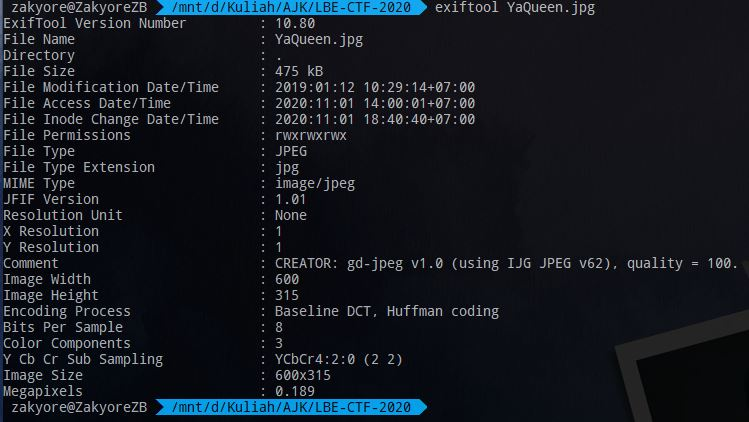
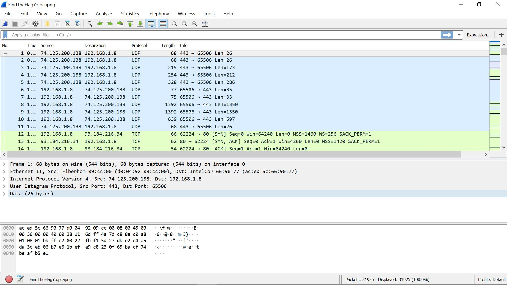

# Forensik
Forensik dalam dunia digital adalah seni untuk memulihkan jejak-jejak digital yang tertinggal di sebuah komputer. Dalam CTF sendiri, kategori forensik mencakup challenge-challenge yang bertujuan untuk mendapatkan suatu informasi tersembunyi dengan cara memeriksa dan memproses sebuah data statis.

Salah satu hal penting dalam pengerjaan challenge forensik adalah penggunaan **tools** yang tepat. Selain itu adalah pengalaman (lol).

Beberapa hal dasar yang perlu dikenali dalam forensik CTF adalah:
+ [Format File dan Data EXIF / metadata](#format-file-dan-data-exif-metadata)
+ [Captured network traffic](#captured-network-traffic)
+ [Steganografi](#steganografi)

### Format File dan Data EXIF / metadata
Exchangeable Image File Format atau biasa disebut Exif adalah sebuah standar untuk data-data tambahan yang berada pada sebuah file atau foto. Data-data ini bisa berupa banyak hal, seperti: tipe dari sebuah file, kapan dan dimana sebuah foto diambil, kecepatan shutter kamera yang digunakan, apakah file tersebut pernah diubah, dan informasi-informasi lainnya.

Dalam forensik, informasi-informasi tersebut dapat memuat clue dari tujuan akhir kita (di sini tentu untuk mendapatkan flag).

Selain menggunakan exiftool, tipe dari sebuah file juga dapat dilihat dari **magic byte** yang dimilikinya. Magic byte sendiri adalah beberapa byte pada sebuah file yang menunjukkan tipe dari sebuah file. Magic byte ini biasanya berada di awal file dan memiliki panjang 2-4 bytes.

##### Tools
+ exiftools (`apt-get install exiftool`)
+ http://exif.regex.info/exif.cgi
+ hexdump (linux command)
+ xxd (linux command)
+ hxd (Windows)
+ file (linux command)

### Captured Network traffic
Seperti namanya, pada tipe soal ini biasanya kalian akan diberikan file **.pcapng**. File tersebut merupakan traffic dari sebuah network yang berhasil ditangkap. Kalian akan diminta untuk mencari flag-nya di sana.

Flag bisa didapatkan se-mudah mencari string biasa ataupun harus mendapatkan suatu objek terlebih dahulu. Dimana flag-nya bisa didapatkan dari objek tersebut.

##### Tools
+ Wireshark

### Steganografi
Steganografi adalah sebuah seni penyembunyian data dari mata telanjang. Pesan yang ingin disampaikan tidak dapat dilihat secara sekilas. Dibutuhkan ketelitian, pemeriksaan, dan sedikit pengubahan dari cara kita melihat media tersebut untuk bisa mendapatkan pesan yang sesungguhnya.

Challenge-challenge steganografi biasanya berhubungan dengan media (gambar, audio, dan sejenisnya) sehingga dibutuhkan tools yang dapat membaca maupun mengolah jenis-jenis file tersebut
##### Tools
+ Audacity (audio)
+ Gimp/Photoshop dan sejenisnya

### Tools berguna lainnya
+ binwalk (`apt-get install binwalk`)
+ foremost (`apt-get install foremost`)

### Referensi
+ https://ctf101.org/forensics/overview/
+ https://trailofbits.github.io/ctf/forensics/
